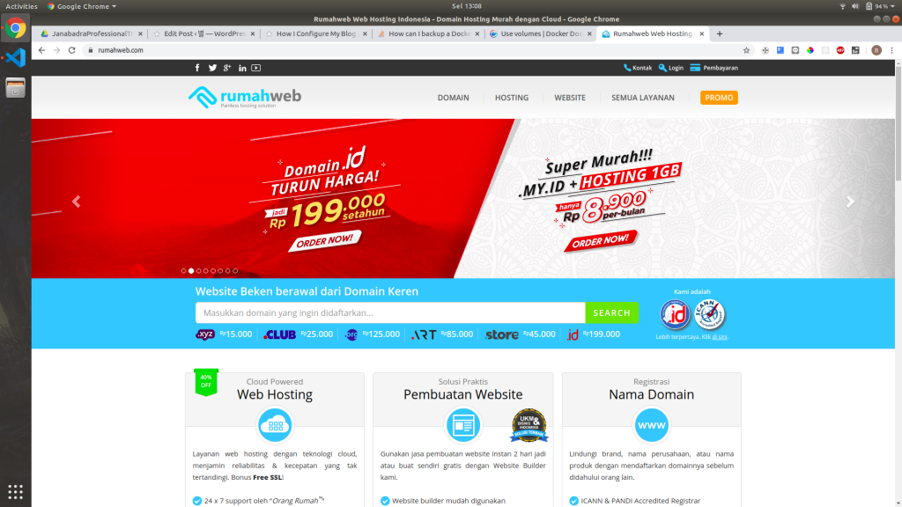
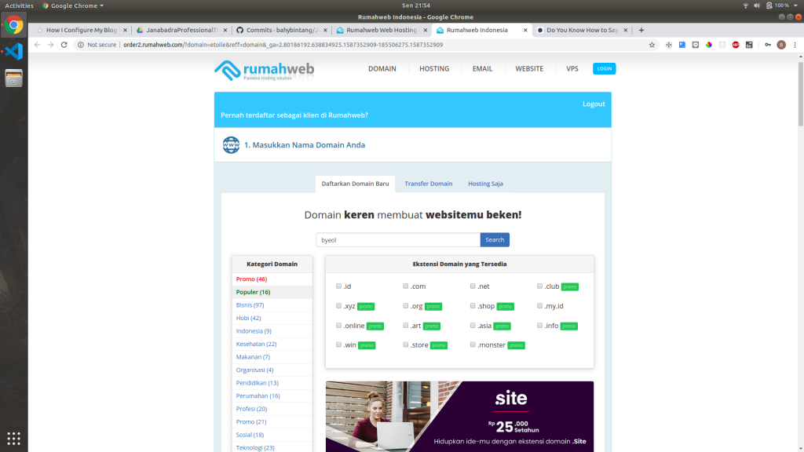
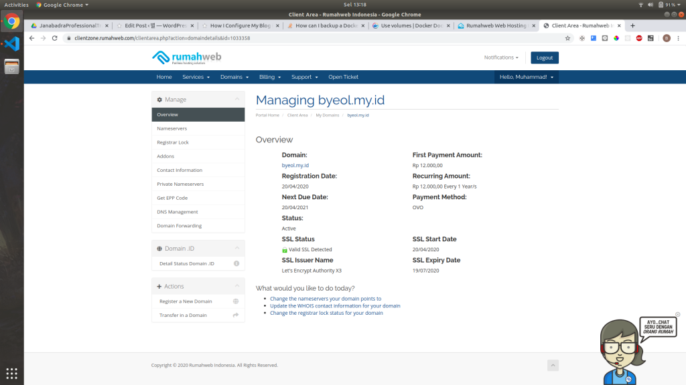
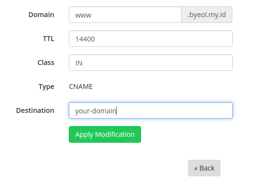
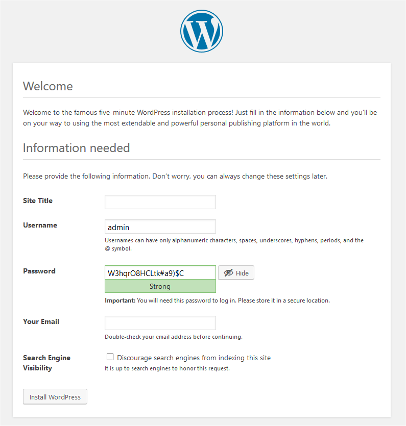

Hello, this is my first post and I want to share something that I just learned. Actually I am making this post just a few hours after I am done setting my server. So I’d like to share how I configure my server to run WordPress + NGINX + MySQL using Docker. Ok, lets get started 😉

I’m inspired to create this post because of some article I read on how to install WordPress using docker-compose. The article I read is [this article](https://www.digitalocean.com/community/tutorials/how-to-install-wordpress-with-docker-compose) from DigitalOcean.

That article explained how to configure WordPress using docker in really good details. But I feel like maybe that article is too complicated and does not give you a way to automate your configuration. So in this post I will try 😉 to explained in simplified way, and guide you to automate the process of running WordPress using docker.

**I’d like to divide this post into four parts:**
- Setting up our web server (AWS EC2)
- Setting up our domain name (Rumah Web)
- Configure our configuration files
- Run / deploy into your server

### 1. Setting Up Our Server
In this post I will be using AWS EC2 Instance as our server, and I will be using t2.micro instance type (because this is what I get for AWS Free Tier 😉 ). I assume that you already have AWS account 🙁 .

Ok, lets get to it!.

#### Login to your AWS Console


If you are successfully logged in, you should be greeted by that page. At first maybe it looks really complicated and scary (well at least for me 😀 ).

I will not explain all the options because most of it is not related to this post (and I dont really know much about them 😀 ). So from this page you just click the **Launch a virtual machine** option.

#### Choose your machine image


In this process, you basically need to pick what OS you want to use as your server. You can choose any of the OS, but for the sake of simplicity I recommend you to use **Amazon Linux 2 AMI (HVM), SSD Volume Type (64 bit x86)**.

Click select on your preffered OS, and you will be redirected to the next step.

#### Review your configuration
After you select the OS type that you want. You will be redirected to another page to confirm your configuration. In this post we will be leaving all of the configuration as default. So you should just click **Review and Launch**.

After that you will be seeing another page asking you to review your configuration. You should just click **Launch**.

#### Save your key file


After you click **Launch**, there will be a modal popping up to ask you about the key you are gonna be using for your instance. This key will be needed if you want to connect to your machine.

In that modal you will be asked to use **existing key** (if it’s exists) or **create a new key pair**. In this tutorial I will recommend you to make a new key pair, by choosing the option to **create a new key pair** on the dropdown.

After that you should give your new key a name. This name does not really matter, but of course you should save it with a name that descriptive so you can easily locate the key for your instance.

After you give it a name, download the key. Make sure you save it in a safe place that no other people can easily access.

#### Launch your instance

After downloading the key, the button to **Launch Instances** should be available, and of course you should click it 😉.


Voila! your instance is now launching. You can click **View Instances** if you want to see your new instance status.

#### Your instance


In your instance page, you can see all information about your instance like Public IP, Public DNS, and your instance status. This information will be usable for the next step when setting up your domain

#### Setting up security group

After your instance successfully ran. You must configure your security group, so your instance can be accessed from the internet.

Simply click your instance in instance page, and you will see instance information popping in the bottom of your page. On the right side of the **Description** tab, you can see security groups field.


To configure your security groups, you can click on **launch-wizard-x**. You will be redirected to security groups configuration page. After that click your security groups id to advance to the next step.


In this page you should see your security groups config. You can see that the default **inbound rules** (basically who can access your port X from the internet) is ssh which is used to connect to your machine later.

In this step we should expose port 80 (HTTP) and port 443 (HTTPS) to the internet, because our application will be accessed from that port. So you can click **Edit inbound rules** to edit your inbound rules.


You can add the above configuration to allow access from the internet to port 80 and 443. And the click **Save Rules**.

#### Setting up your instance

To setting up your instance, first you must be connected to your instance. One of the best way to connect to your instance is using SSH (Secure Shell).

To connect to your instance, you can connect using the command provided by **AWS Console** on instance page. Yo can right click on your instance and then choose connect. 


There you can follow the instruction to connect to your instance. Make sure your current working directory is the same directory as where you save your key file.

After you successfully logged in to your instance. There some apps that you need to install in order for you to configure your instance. You must install **docker** and some kind of text editor. In this tutorial I will use **vim**. Of course you can edit your configuration file in your local machine and then push it to repository, in that case you need to install **git** too. To install that dependency you can run this commands.

```sh
sudo yum install docker vim git
```

After you successfully installed that dependencies, your instance is ready to rock! 🙂

### 2. Setting Up Your Domain

In this post I will you RumahWeb as my domain provider because its cheap. Of course you can use any domain provider that you like.

#### Register to RumahWeb

You can go too https://www.rumahweb.com/. In there you can search for the availability of your desired domain. And you can see your the pricing too.



When you chosen your desired domain, you can then checkout and proceed with your payments.



After you successfully paid you can see your domain is available in your dashboard. You click the **domain** tab and you will be redirected to domain configuration page.


There you can see a list of domains that you own. You can **click the wrench icon** to configure your domain.



You can see your domain information in this page. To further configure your domain, click on **DNS Management** in the sidebar. 


You must add a new record by clicking **Add New Record**

The first one that you must add is and **A Record** with your public IP as destination.


You can replace **your-ip** with your AWS EC2 instance public IP. You can see that in your AWS Console.

And the second one that you must add is **CNAME Record** pointing to your domain.



You can replace **your-domain** with you current domain that you are managing. And after that we finished setting up our domain. Yay 🙂

### 3. Configure Our Configuration Files

We gonna make some configuration files so we can start WordPress in our server. You can make these files in your local machine then push it to git, or make it in your remote server (instance). In this post I will be using vim to edit our configuration files.

#### Making your working directory

To make it easier to develop, so your files doesn’t get mixed with other files you can make your own working directory, and change directory to that directory. By running this command:

```sh
mkdir my-blog
cd my-blog
```

You can replace **my-blog** with any names you want.

#### Making docker-compose.staging.yml

This docker-compose file is gonna let you configure your staging container. This will getting your **database** and **wordpress** up, and start your **nginx** in staging environment. I’m not gonna be explaining the configuration in here in detail because you can see the detail explanation in [DigitalOcean post](https://www.digitalocean.com/community/tutorials/how-to-install-wordpress-with-docker-compose).

First you must create the file and edit it.

```sh
touch docker-compose.staging.yml
vim docker-compose.staging.yml
```

To change to insert mode you can press **I** in your keyboard.

And then paste this code:

```yml
version: "3"

services:
  db:
    image: mysql:8.0.19
    container_name: db
    restart: unless-stopped
    env_file: .env
    volumes:
      - dbdata:/var/lib/mysql
    command: "--default-authentication-plugin=mysql_native_password"
    networks:
      - app-network

  wordpress:
    depends_on:
      - db
    image: wordpress:5.4.0-php7.4-fpm-alpine
    container_name: wordpress
    restart: unless-stopped
    env_file: .env
    environment:
      - WORDPRESS_DB_HOST=db:3306
      - WORDPRESS_DB_USER=$MYSQL_USER
      - WORDPRESS_DB_PASSWORD=$MYSQL_PASSWORD
      - WORDPRESS_DB_NAME=$MYSQL_DATABASE
    volumes:
      - wordpress:/var/www/html
    networks:
      - app-network

  webserver:
    depends_on:
      - wordpress
    image: nginx:1.17.10-alpine
    container_name: webserver
    restart: unless-stopped
    env_file: .env
    ports:
      - "80:80"
    volumes:
      - wordpress:/var/www/html
      - ./nginx-conf/nginx.staging.conf:/etc/nginx/conf.d/nginx.conf
      - certbot-etc:/etc/letsencrypt
    networks:
      - app-network
      
volumes:
  certbot-etc:
  wordpress:
  dbdata:

networks:
  app-network:
    driver: bridge
```

And to save you can press **Esc** then type **:wq** and then hit **Enter**.

#### Making docker-compose.yml

This docker-compose file is gonna be used to create you production environment. This will run the **certbot** to configure your SSL, and recreate **nginx** to the production environment.

```sh
touch docker-compose.staging.yml
vim docker-compose.staging.yml
```

And paste this:

```yml
version: "3"

services:
  db:
    image: mysql:8.0.19
    container_name: db
    restart: unless-stopped
    env_file: .env
    volumes:
      - dbdata:/var/lib/mysql
    command: "--default-authentication-plugin=mysql_native_password"
    networks:
      - app-network

  wordpress:
    depends_on:
      - db
    image: wordpress:5.4.0-php7.4-fpm-alpine
    container_name: wordpress
    restart: unless-stopped
    env_file: .env
    environment:
      - WORDPRESS_DB_HOST=db:3306
      - WORDPRESS_DB_USER=$MYSQL_USER
      - WORDPRESS_DB_PASSWORD=$MYSQL_PASSWORD
      - WORDPRESS_DB_NAME=$MYSQL_DATABASE
    volumes:
      - wordpress:/var/www/html
    networks:
      - app-network

  webserver:
    depends_on:
      - wordpress
    image: nginx:1.17.10-alpine
    container_name: webserver
    restart: unless-stopped
    env_file: .env
    ports:
      - "80:80"
      - "443:443"
    volumes:
      - wordpress:/var/www/html
      - ./nginx-conf/nginx.conf:/etc/nginx/conf.d/nginx.conf
      - ./nginx-conf/options-ssl-nginx.conf:/etc/nginx/conf.d/options-ssl-nginx.conf
      - certbot-etc:/etc/letsencrypt
    networks:
      - app-network

  certbot:
    depends_on:
      - webserver
    image: certbot/certbot
    container_name: certbot
    volumes:
      - certbot-etc:/etc/letsencrypt
      - wordpress:/var/www/html
    command: certonly --webroot --webroot-path=/var/www/html --email $USER_EMAIL --agree-tos --no-eff-email --force-renewal -d $USER_DOMAIN -d www.$USER_DOMAIN

volumes:
  certbot-etc:
  wordpress:
  dbdata:

networks:
  app-network:
    driver: bridge
```

#### Making nginx.staging.conf

This configuration file is gonna be used for **nginx** to run in staging environment

```sh
mkdir -p nginx-conf
touch nginx-conf/nginx.staging.conf
vim nginx-conf/nginx.staging.conf
```

And paste this:

```nginx
server {
        listen 80;
        listen [::]:80;

        server_name your.domain www.your.domain;

        index index.php index.html index.htm;

        root /var/www/html;

        location ~ /.well-known/acme-challenge {
                allow all;
                root /var/www/html;
        }

        location / {
                try_files $uri $uri/ /index.php$is_args$args;
        }

        location ~ \.php$ {
                try_files $uri =404;
                fastcgi_split_path_info ^(.+\.php)(/.+)$;
                fastcgi_pass wordpress:9000;
                fastcgi_index index.php;
                include fastcgi_params;
                fastcgi_param SCRIPT_FILENAME $document_root$fastcgi_script_name;
                fastcgi_param PATH_INFO $fastcgi_path_info;
        }

        location ~ /\.ht {
                deny all;
        }

        location = /favicon.ico { 
                log_not_found off; access_log off; 
        }
        location = /robots.txt { 
                log_not_found off; access_log off; allow all; 
        }
        location ~* \.(css|gif|ico|jpeg|jpg|js|png)$ {
                expires max;
                log_not_found off;
        }
}
```

You should replace **your.domain** with your own domain name.

#### Get the recommended Nginx Security Parameters from Certbot

Run this command to download the configuration file from Certbot:

```sh
curl -sSLo nginx-conf/options-ssl-nginx.conf https://raw.githubusercontent.com/certbot/certbot/master/certbot-nginx/certbot_nginx/_internal/tls_configs/options-ssl-nginx.conf
```

#### Making run.sh to Automate the Deploy Process

This **run.sh** bash script will automate the deployment process, but it is just basically some bash command put together. Of course you can invoke the command manually 🙂

```sh
touch run.sh
vim run.sh
```

And paste this:

```sh
#!/bin/bash

docker-compose -f docker-compose.staging.yml up -d
docker-compose up --no-deps certbot
docker-compose stop webserver
docker-compose up -d --force-recreate --no-deps webserver
```

And dont forget to make it executable using this command:

```sh
chmod +x run.sh
```

This script will basically run the **database**, **wordpress**, and **nginx** in staging environment. And then run the **certbot** in production mode. This **certbot** will verify the domain by challenging the webserver (nginx). Note that at this state **nginx** is still in staging environment.

If the **certbot** successfully confirming the domain, it will create an SSL configuration file in the docker volume **certbot-etc** which is mounted to **/etc/letsencrypt** in webserver (**nginx**) container.

After the **certbot** successfully confirming the domain, the script will recreate the webserver (**nginx**) in production mode.

### 4. Run / Deploy your Apps

To run your apps its actually very easy 🙂 . You just need to run the run.sh script.

```bash
./run.sh
```

And voila! you just need a few minutes until your worpress blog is up. Now you can access your domain and proceed with WordPress famous 5 minutes install 🙂



### Conclusion

- This post is far from perfect, I’m too still learning. So I’m open to any suggestions.
- The method that is used in this post might not be the best way to configure WordPress. A lot of other method that is easier and achieve the same result.

### Reference
- https://www.digitalocean.com/community/tutorials/how-to-install-wordpress-with-docker-compose
- https://docs.aws.amazon.com/
- https://docs.docker.com/compose/
- https://hub.docker.com/_/nginx
- https://hub.docker.com/_/wordpress
- https://hub.docker.com/_/mysql